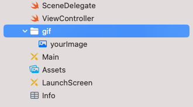

[](http://swift.org)
[](https://img.shields.io/cocoapods/v/SwiftyGif.svg)
[](https://github.com/Carthage/Carthage)
[](https://travis-ci.org/kirualex/SwiftyGif)
[](https://raw.githubusercontent.com/kirualex/SwiftyGif/master/LICENSE)

# SwiftyGif
쉽고 빠르게 Gif를 사용할 수 있습니다.

<p align="center">
    </br>
    
</p>

## 기능
- [x] UIImage와 UIImageView extension을 기반으로 구현했습니다.
- [x] 원격 GIF를 불러올 수 있고, 로딩 바를 설정할 수 있습니다.
- [x] 뛰어난 CPU/메모리 성능을 보입니다.
- [x] 반복 재생 횟수를 조정할 수 있습니다.
- [x] 'levelOfIntegrity' 파라미터를 통해 Integrity 레벨을 조절합니다.
- [x] 'memoryLimit' 파라미터를 통해 CPU/메모리 사용량을 조절합니다. (CPU - 메모리는 tradeoff 관계)

## 설치

### CocoaPods 사용
```ruby
source 'https://github.com/CocoaPods/Specs.git'
use_frameworks!
pod 'SwiftyGif'
```

### Carthage 사용
[애플리케이션에 프레임워크 추가하기](https://github.com/Carthage/Carthage#adding-frameworks-to-an-application)에 나온 일반적인 카르타고 사용법을 사용합니다.
`Cartfile`에 나열된 프레임워크 중에서 SwityGif를 추가할 때, [GitHub repositories](https://github.com/Carthage/Carthage/blob/master/Documentation/Artifacts.md#github-repositories)에 구문을 적용합니다.:

```
github "kirualex/SwiftyGif"
```

### Swift Package Manager 사용
```ruby
https://github.com/kirualex/SwiftyGif.git
```

## 사용법

### 프로젝트 파일  
  

현재 Xcode `xcassets` 폴더는 `.gif` 파일을 이미지로 인식하지 못합니다. 즉 assets밖에 '.gif' 파일을 위치시켜야 합니다. `gif` 폴더를 만들어 그 안에서 관리하는 것을 추천합니다.

### 빠른 시작

SwiftyGif는 `UIImage`와 `UIImageView` 를 사용합니다.

#### 코드

```swift
import SwiftyGif

do {
    let gif = try UIImage(gifName: "MyImage.gif")
    let imageview = UIImageView(gifImage: gif, loopCount: 3) // 3번 반복
    imageview.frame = view.bounds
    view.addSubview(imageview)
} catch {
    print(error)
}
```

#### nib/storyboard 사용

```swift
@IBOutlet var myImageView : UIImageView!
...

let gif = try UIImage(gifName: "MyImage.gif")
self.myImageView.setGifImage(gif, loopCount: -1) // 무한 반복
```

#### 원격 GIFs

```swift
// GIF를 나타내는 URL을 설정합니다
let url = URL(string: "...")
let loader = UIActivityIndicatorView(style: .white)
cell.gifImageView.setGifFromURL(url, customLoader: loader)
```

### 성능
`SwiftyGifManager`는 같은 메모리 풀은 사용해 하나 이상의 UIImageView를 관리합니다. 이를 사용해 쉽게 메모리 제한을 할 수 있습니다. 따로 매니저를 선언하지 않는다면 `SwiftyGifManager.defaultManager`를 사용합니다.

#### Integrity 레벨
Integrity 레벨을 낮게 설정하면 프레임을 건너뜁니다. CPU와 메모리 사용량도 낮춥니다. 많은 gif를 한 번에 미리보기 할 때 유용한 옵션입니다.

```swift
do {
    let gif = try UIImage(gifName: "MyImage.gif", levelOfIntegrity:0.5)
} catch {
    print(error)
}
```

### 제어
SwiftyGif는 `UIImageVIew`에 대해 다양한 제어 기능을 제공합니다.

```swift
self.myImageView.startAnimatingGif()
self.myImageView.stopAnimatingGif()
self.myImageView.showFrameAtIndexDelta(delta: Int)
self.myImageView.showFrameAtIndex(index: Int)
```

더 쉽게 사용하기 위한 메소드들이 제공됩니다. :

```swift
self.myImageView.isAnimatingGif() // 현재 gif가 재생중인지 아닌지
self.myImageView.gifImage!.framesCount() // 해당 gif 프레임 수 리턴
```

### Delegate
SwiftyGifDelegate를 선언해 gif 생명 주기(=Lifecycle)를 받습니다. 예를 들어 `MyController`라는 ViewController를 delegate로 사용합니다.:

```swift
override func viewDidLoad() {
        super.viewDidLoad()
        self.imageView.delegate = self
}
```

extension에 채택해 쉽게 사용할 수 있습니다.:

```swift
extension MyController : SwiftyGifDelegate {

    func gifURLDidFinish(sender: UIImageView) {
        print("gifURLDidFinish")
    }

    func gifURLDidFail(sender: UIImageView) {
        print("gifURLDidFail")
    }

    func gifDidStart(sender: UIImageView) {
        print("gifDidStart")
    }
    
    func gifDidLoop(sender: UIImageView) {
        print("gifDidLoop")
    }
    
    func gifDidStop(sender: UIImageView) {
        print("gifDidStop")
    }
}
```

## 벤치마크
### 이미지 1개
|               |CPU 사용량(평균) |메모리 사용량(평균) |
|:-------------:|:-----------------:|:-----------------------:|
|FLAnimatedImage|35%                |9,5Mb                    |
|SwiftyGif      |2%                 |18,4Mb                   |
|SwiftyGif(memoryLimit:10)|34%      |9,5Mb                    |

### 이미지 6개
|               |CPU 사용량(평균) |메모리 사용량(평균) |
|:-------------:|:-----------------:|:-----------------------:|
|FLAnimatedImage|65%                |25,1Mb                   |
|SwiftyGif      |22%                |105Mb                    |
|SwiftyGif(memoryLimit:20)|45%      |26Mb                     |

테스트 환경 : iPhone 6S, iOS 9.3.1, Xcode 7.3.   
메모리를 제한하면 CPU 사용량이 늘어나는 것을 확인할 수 있습니다. (trade-off)